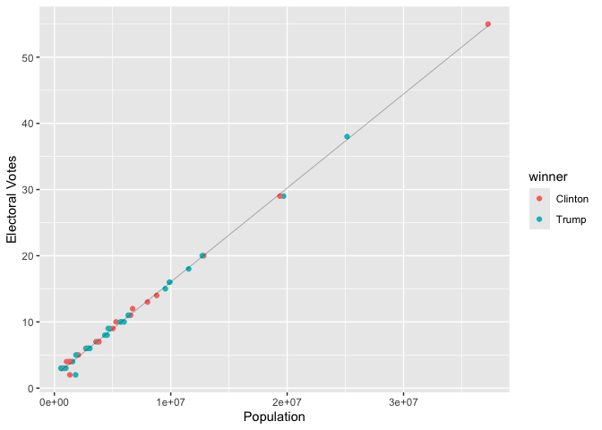
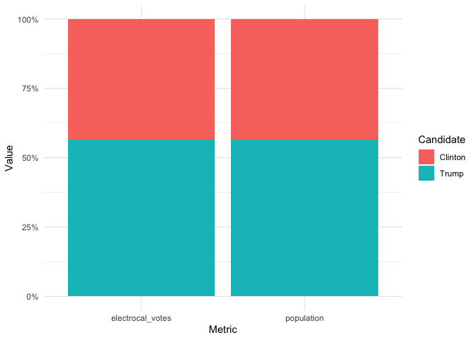
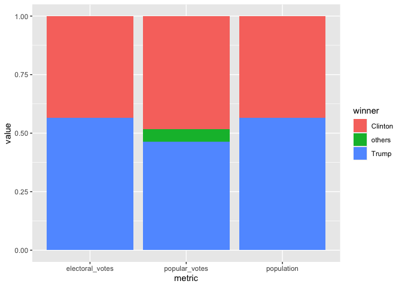
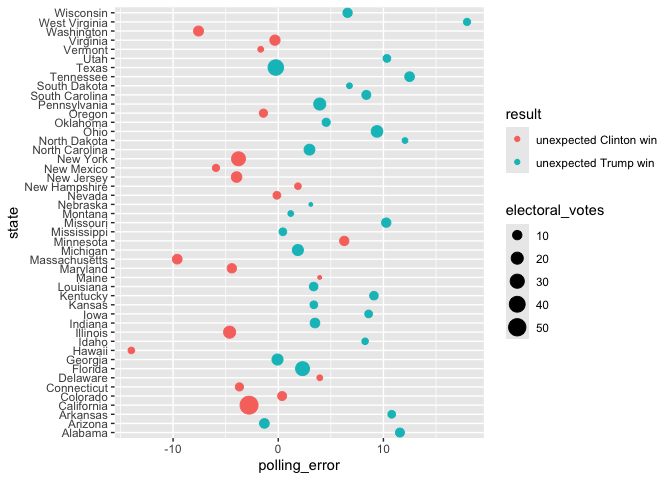

# assignment_7


``` r
library(tidyverse)
library(knitr) 
library(dslabs)

library(dslabs) #install.packages("dslabs")
```

## Exercise: 2016 Election Results and Polling

In this exercise, we will explore data from the **2016 US presidential
election**, including official election results, polling data, and
population information.  
We will use the following three datasets from the `dslabs` package:

- `results_us_election_2016`: Election results and electoral college
  votes.  
- `polls_us_election_2016`: Poll results from the 2016 presidential
  election.  
- `murders`: Gun murder data (includes population of each state).

We will also use these
[datasets](https://raw.githubusercontent.com/kshaffer/election2016/master/2016ElectionResultsByState.csv)
to compute the exact numbers of votes in Question 3.

## Question 1. What is the relationship between the population size and the number of electoral votes each state has?

### 1a.

Use a `join function` to combine the `murders` dataset, which contains
information on population size, and the `results_us_election_2016`
dataset, which contains information on the number of electoral votes.
Name this new dataset `q_1a` and show its first 6 rows.

``` r
q_1a <- murders |> left_join(results_us_election_2016, by = "state")

head(q_1a)
```

           state abb region population total electoral_votes  clinton    trump
    1    Alabama  AL  South    4779736   135               9 34.35795 62.08309
    2     Alaska  AK   West     710231    19               3 36.55087 51.28151
    3    Arizona  AZ   West    6392017   232              11 44.58042 48.08314
    4   Arkansas  AR  South    2915918    93               6 33.65190 60.57191
    5 California  CA   West   37253956  1257              55 61.72640 31.61711
    6   Colorado  CO   West    5029196    65               9 48.15651 43.25098
       johnson     stein  mcmullin    others
    1 2.094169 0.4422682 0.0000000 1.0225246
    2 5.877128 1.8000176 0.0000000 4.4904710
    3 4.082188 1.3185997 0.6699155 1.2657329
    4 2.648769 0.8378174 1.1653206 1.1242832
    5 3.374092 1.9649200 0.2792070 1.0382753
    6 5.183748 1.3825031 1.0400874 0.9861714

### 1b.

Add a new variable in the `q_1a` dataset to indicate which candidate won
in each state, and remove the columns `abb`, `region`, and `total`. Name
this new dataset `q_1b`, and show its first 6 rows.

``` r
q_1b <- q_1a |>
  mutate(
    winner = case_when(clinton > trump ~ "Clinton", trump > clinton ~ "Trump", TRUE ~ "Tie")) |>
  select(-abb, -region, -total)

head(q_1b)
```

           state population electoral_votes  clinton    trump  johnson     stein
    1    Alabama    4779736               9 34.35795 62.08309 2.094169 0.4422682
    2     Alaska     710231               3 36.55087 51.28151 5.877128 1.8000176
    3    Arizona    6392017              11 44.58042 48.08314 4.082188 1.3185997
    4   Arkansas    2915918               6 33.65190 60.57191 2.648769 0.8378174
    5 California   37253956              55 61.72640 31.61711 3.374092 1.9649200
    6   Colorado    5029196               9 48.15651 43.25098 5.183748 1.3825031
       mcmullin    others  winner
    1 0.0000000 1.0225246   Trump
    2 0.0000000 4.4904710   Trump
    3 0.6699155 1.2657329   Trump
    4 1.1653206 1.1242832   Trump
    5 0.2792070 1.0382753 Clinton
    6 1.0400874 0.9861714 Clinton

### 1c.

Using the `q_1b` dataset, plot the relationship between population size
and number of electoral votes. Use color to indicate who won the state.
Fit a straight line to the data, set its color to black, size to 0.1,
and turn off its confidence interval.

``` r
ggplot(q_1b, aes(x = population, y = electoral_votes, color = winner)) +
  geom_point() +
  geom_smooth(method = "lm", se = FALSE, color = "black", size = 0.1) +
  labs(x = "Population", y = "Electoral Votes")
```



## Question 2. Would the election result be any different if the number of electoral votes is exactly proportional to a state’s population size?

### 2a.

First, convert the `q_1b` dataset to longer format such that the
population and `electoral_votes` columns are turned into rows as shown
below. Name this new dataset `q_2a`, and show its first 6 rows.

``` r
q_2a <- q_1b |>
  pivot_longer(
    cols = c(population, electoral_votes),
    names_to = "metric",
    values_to = "value"
  )

head(q_2a)
```

    # A tibble: 6 × 10
      state   clinton trump johnson stein mcmullin others winner metric        value
      <chr>     <dbl> <dbl>   <dbl> <dbl>    <dbl>  <dbl> <chr>  <chr>         <dbl>
    1 Alabama    34.4  62.1    2.09 0.442    0       1.02 Trump  population   4.78e6
    2 Alabama    34.4  62.1    2.09 0.442    0       1.02 Trump  electoral_v… 9   e0
    3 Alaska     36.6  51.3    5.88 1.80     0       4.49 Trump  population   7.10e5
    4 Alaska     36.6  51.3    5.88 1.80     0       4.49 Trump  electoral_v… 3   e0
    5 Arizona    44.6  48.1    4.08 1.32     0.670   1.27 Trump  population   6.39e6
    6 Arizona    44.6  48.1    4.08 1.32     0.670   1.27 Trump  electoral_v… 1.1 e1

### 2b.

Then, sum up the number of electoral votes and population size across
all states for each candidate. Name this new dataset `q_2b`, and print
it as shown below.

``` r
q_2b <- q_2a |> 
  group_by(winner, metric) |> 
  summarise(value = sum(value))

q_2b |> 
  kable()
```

| winner  | metric          |     value |
|:--------|:----------------|----------:|
| Clinton | electoral_votes |       231 |
| Clinton | population      | 134982448 |
| Trump   | electoral_votes |       302 |
| Trump   | population      | 174881780 |

### 2c.

Use the `q_2b` dataset to contruct a bar plot to show the final
electoral vote share under the scenarios of 1) each state has the number
of electoral votes that it currently has, and 2) each state has the
number of electoral votes that is exactly proportional to its population
size. Here, assume that for each state, the winner will take all its
electoral votes.

Hint: `geom_col(position = "fill")` might be helpful.

``` r
q_2b |> 
  ggplot(aes(x = metric, y = value, fill = winner)) +
  geom_col(position = "fill") +
  scale_y_continuous()
```



## Question 3. What if the election was determined by popular votes?

### 3a.

First, from [this dataset on
GitHub](https://raw.githubusercontent.com/kshaffer/election2016/master/2016ElectionResultsByState.csv),
calculate the number of popular votes each candidate received as shown
below. Name this new dataset `q_3a`, and print it.

*Note: Vote counts are listed for several other candidates. Please
combine the votes for all candidates other than Clinton and Trump into a
single `others` category (as shown in the table below)*

*Hint: `pivot_longer()` may be useful in here.*

``` r
q_3a <- read_csv("https://raw.githubusercontent.com/kshaffer/election2016/master/2016ElectionResultsByState.csv")


q_3a <- q_3a |> 
  select(-totalVotes) |> 
  pivot_longer(
    cols = ends_with("Votes"),
    names_to = "candidate",
    values_to = "votes") |> 
  mutate(
    winner = case_when(
      candidate == "clintonVotes" ~ "Clinton",
      candidate == "trumpVotes" ~ "Trump",
      TRUE ~ "others")) |> 
  group_by(winner) |>  
  summarise(value = sum(votes)) |>  
  mutate(metric = "popular_votes") |> 
  select(metric, winner, value)

q_3a |> 
  arrange(-value) |> 
  kable()
```

| metric        | winner  |    value |
|:--------------|:--------|---------:|
| popular_votes | Clinton | 65125640 |
| popular_votes | Trump   | 62616675 |
| popular_votes | others  |  7054974 |

### 3b.

Combine the `q_2b` dataset with the `q_3a` dataset. Call this new
dataset `q_3b`, and print it as shown below.

``` r
q_3b <- q_2b |> 
  full_join(q_3a, join_by(metric, winner, value)) |> 
  arrange(metric)

q_3b |> 
  kable()
```

| winner  | metric          |     value |
|:--------|:----------------|----------:|
| Clinton | electoral_votes |       231 |
| Trump   | electoral_votes |       302 |
| Clinton | popular_votes   |  65125640 |
| Trump   | popular_votes   |  62616675 |
| others  | popular_votes   |   7054974 |
| Clinton | population      | 134982448 |
| Trump   | population      | 174881780 |

### 3c.

Lastly, use the `q_3b` dataset to contruct a bar plot to show the final
vote share under the scenarios of 1) each state has the number of
electoral votes that it currently has, 2) each state has the number of
electoral votes that is exactly proportional to its population size, and
3) the election result is determined by the popular vote.

``` r
q_3b |> 
  ggplot(aes(x = metric, y = value, fill = winner)) +
  geom_col(position = "fill") +
  scale_y_continuous()
```



## Question 4. The election result in 2016 came as a huge surprise to many people, especially given that most polls predicted Clinton would win before the election. Where did the polls get wrong?

### 4a.

The polling data is stored in the data frame `polls_us_election_2016`.
For the sake of simplicity, we will only look at the data from a single
poll for each state. Subset the polling data to include only the results
from the pollster Ipsos. Exclude national polls, and for each state,
select the polling result with the enddate closest to the election day
(i.e. those with the lastest end date). Keep only the columns `state`,
`adjpoll_clinton`, and `adjpoll_trump`. Save this new dataset as `q_4a`,
and show its first 6 rows.

*Note: You should have 47 rows in `q_4a`because only 47 states were
polled at least once by Ipsos. You don’t need to worry about the 3
missing states and DC.*

*Hint: `group_by()` and `slice_max()` can be useful for this question.
Check out the help file for `slice_max()` for more info.*

``` r
q_4a <- polls_us_election_2016 |> 
  filter(pollster == "Ipsos", state != "U.S.")  |> 
  group_by(state) |> 
  slice_max(enddate) |> 
  select(state, adjpoll_clinton, adjpoll_trump)

q_4a |> 
  head(6) |> 
  kable()
```

| state       | adjpoll_clinton | adjpoll_trump |
|:------------|----------------:|--------------:|
| Alabama     |        37.54023 |      53.69718 |
| Arizona     |        41.35774 |      46.17779 |
| Arkansas    |        37.15339 |      53.28384 |
| California  |        58.33806 |      31.00473 |
| Colorado    |        46.00764 |      40.73571 |
| Connecticut |        48.81810 |      38.87069 |

### 4b.

Combine the `q_4a` dataset with the `q_1b` dataset with a join function.
The resulting dataset should only have 47 rows. Create the following new
variables in this joined dataset.

- `polling_margin`: difference between `adjpoll_clinton` and
  `adjpoll_trump`

- `actual_margin`: difference between `clinton` and `trump`

- `polling_error`: difference between `polling_margin` and
  `actual_margin`

- `predicted_winner:` predicted winner based on `adjpoll_clinton` and
  `adjpoll_trump`

- `results= ifelse(winner == predicted_winner, "correct prediction", str_c("unexpected ", winner, " win"))`  
    
  Keep only the columns `state`, `polling_error`, `result`,
  `electoral_votes`. Name the new dataset `q_4b` and show its first 6
  rows.

``` r
q_4b <- q_4a |> 
  left_join(q_1b) |> 
  mutate(polling_margin = adjpoll_trump - adjpoll_clinton, 
         actual_margin = trump - clinton, 
         polling_error = actual_margin - polling_margin, 
         predicted_winner = ifelse (adjpoll_clinton > adjpoll_trump, "clinton", "trump"), 
         result = ifelse(winner == predicted_winner, "correct prediction", str_c("unexpected ", winner, " win"))) |> 
  select(state, polling_error, result, electoral_votes)

q_4b |> 
  head(6) |> 
  kable()
```

| state       | polling_error | result                 | electoral_votes |
|:------------|--------------:|:-----------------------|----------------:|
| Alabama     |    11.5681966 | unexpected Trump win   |               9 |
| Arizona     |    -1.3173239 | unexpected Trump win   |              11 |
| Arkansas    |    10.7895518 | unexpected Trump win   |               6 |
| California  |    -2.7759631 | unexpected Clinton win |              55 |
| Colorado    |     0.3663946 | unexpected Clinton win |               9 |
| Connecticut |    -3.6919767 | unexpected Clinton win |               7 |

### 4c.

Generate the following plot with the `q_4b` dataset. Use chunk options
to adjust the dimensions of the plot to make it longer than the default
dimension. Based on this plot, where did the polls get wrong in the 2016
election?

``` r
q_4b |> 
  ggplot(mapping = aes(x = polling_error, y = state, color = result, size = electoral_votes)) +
  geom_point()
```


