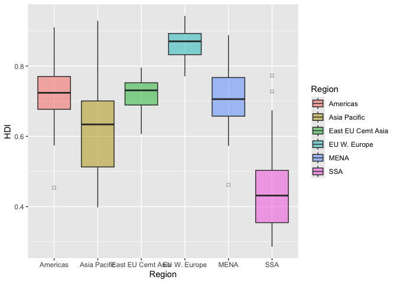

# assignment_4.qmd


``` r
#install.packages(tidyverse)
library (tidyverse) #install.packages(tidyverse)
```

    ── Attaching core tidyverse packages ──────────────────────── tidyverse 2.0.0 ──
    ✔ dplyr     1.1.4     ✔ readr     2.1.5
    ✔ forcats   1.0.0     ✔ stringr   1.5.2
    ✔ ggplot2   3.5.2     ✔ tibble    3.3.0
    ✔ lubridate 1.9.4     ✔ tidyr     1.3.1
    ✔ purrr     1.1.0     
    ── Conflicts ────────────────────────────────────────── tidyverse_conflicts() ──
    ✖ dplyr::filter() masks stats::filter()
    ✖ dplyr::lag()    masks stats::lag()
    ℹ Use the conflicted package (<http://conflicted.r-lib.org/>) to force all conflicts to become errors

``` r
library(tidyverse)
library(knitr)

economist_data <- read_csv("https://raw.githubusercontent.com/nt246/NTRES-6100-data-science/master/datasets/EconomistData.csv")
```

    New names:
    Rows: 173 Columns: 6
    ── Column specification
    ──────────────────────────────────────────────────────── Delimiter: "," chr
    (2): Country, Region dbl (4): ...1, HDI.Rank, HDI, CPI
    ℹ Use `spec()` to retrieve the full column specification for this data. ℹ
    Specify the column types or set `show_col_types = FALSE` to quiet this message.
    • `` -> `...1`

``` r
economist_data <- read_csv("https://raw.githubusercontent.com/nt246/NTRES-6100-data-science/master/datasets/EconomistData.csv")
```

    New names:
    Rows: 173 Columns: 6
    ── Column specification
    ──────────────────────────────────────────────────────── Delimiter: "," chr
    (2): Country, Region dbl (4): ...1, HDI.Rank, HDI, CPI
    ℹ Use `spec()` to retrieve the full column specification for this data. ℹ
    Specify the column types or set `show_col_types = FALSE` to quiet this message.
    • `` -> `...1`

\#Exercise 1. Corruption and human development

# 1.1. Show the first few rows of economist_data

``` r
head(economist_data)
```

    # A tibble: 6 × 6
       ...1 Country     HDI.Rank   HDI   CPI Region           
      <dbl> <chr>          <dbl> <dbl> <dbl> <chr>            
    1     1 Afghanistan      172 0.398   1.5 Asia Pacific     
    2     2 Albania           70 0.739   3.1 East EU Cemt Asia
    3     3 Algeria           96 0.698   2.9 MENA             
    4     4 Angola           148 0.486   2   SSA              
    5     5 Argentina         45 0.797   3   Americas         
    6     6 Armenia           86 0.716   2.6 East EU Cemt Asia

# 1.2 Expore the relationship between human development index (HDI) and corruption perception index (CPI) with a scatter plot as the following.

``` r
ggplot(economist_data, aes(x = HDI, y = CPI)) + geom_point() + labs(x = "Human Development Index (HDI)", y = "Corruption Perception Index (CPI)")
```


# 1.3 Make of color of all points in the previous plot red.

``` r
ggplot(economist_data, aes(x = HDI, y = CPI)) + geom_point(color = "red")
```


# 1.4 Color the points in the previous plot according to the Region variable, and set the size of points to 2.

``` r
ggplot(economist_data, aes(x = HDI, y = CPI, color = Region)) 
```


``` r
ggplot(economist_data, aes(x = HDI, y = CPI, color = Region)) + geom_point(size = 2)
```


# 1.5 Set the size of the points proportional to HDI.Rank

``` r
ggplot(economist_data, aes(x = HDI, y = CPI,color = Region,size = HDI.Rank))
```


``` r
ggplot(economist_data, aes(x = HDI, y = CPI, color = Region, size = HDI.Rank)) + geom_point()
```


# 1.6 Fit a smoothing line to all the data points in the scatter plot from Excercise 1.4

``` r
ggplot(economist_data, aes(x = CPI, y = HDI)) + geom_point(aes(color = Region)) + geom_smooth(se = TRUE)
```

    `geom_smooth()` using method = 'loess' and formula = 'y ~ x'


``` r
ggplot(economist_data, aes(x = HDI, y = CPI, color = Region)) + geom_smooth(se=FALSE)
```

    `geom_smooth()` using method = 'loess' and formula = 'y ~ x'


``` r
ggplot(economist_data, aes(x = CPI, y = HDI, color = Region)) + geom_point() + geom_smooth(se = TRUE)
```

    `geom_smooth()` using method = 'loess' and formula = 'y ~ x'


# 1.7 Fit a separate straight line for each region instead, and turn off the confidence interval.

``` r
ggplot(economist_data, aes(x = CPI, y = HDI, color = Region)) + geom_point() + geom_smooth(method = "lm", se = FALSE)
```

    `geom_smooth()` using formula = 'y ~ x'


# 1.8 Building on top of the previous plot, show each Region in a different facet.

``` r
ggplot(economist_data, aes(x = CPI, y = HDI)) + geom_point(aes(color = 0)) +geom_smooth(method = "lm", se = FALSE) + facet_wrap(~Region)
```

    `geom_smooth()` using formula = 'y ~ x'


\#1.9 Show the distribution of HDI in each region using density plot.
Set the transparency to 0.5

``` r
ggplot(economist_data, aes(HDI, fill = Region)) + geom_density()
```


``` r
ggplot(economist_data, aes(x = HDI, fill = Region)) + geom_density(alpha = 0.5)
```


``` r
colnames(economist_data)
```

    [1] "...1"     "Country"  "HDI.Rank" "HDI"      "CPI"      "Region"  

# 1.10 Show the distribution of HDI in each region using histogram and facetting.

``` r
ggplot(economist_data, aes(x = HDI)) + geom_histogram(fill = "pink", color = "black") + facet_wrap(~Region)
```

    `stat_bin()` using `bins = 30`. Pick better value with `binwidth`.


``` r
ggplot(economist_data, aes(x = HDI, fill = Region)) + geom_histogram(color = 0) + facet_wrap(~Region)
```

    `stat_bin()` using `bins = 30`. Pick better value with `binwidth`.


\#1.11 Show the distribution of HDI in each region using a box plot. Set
the transparency of these boxes to 0.5 and do not show outlier points
with the box plot. Instead, show all data points for each country in the
same plot.

``` r
ggplot(economist_data, aes(x = Region, y = HDI, fill = Region)) + geom_boxplot(alpha = 0.5, outlier.shape = 0)
```



``` r
ggplot(economist_data, aes(x = Region, y = HDI, fill = Region)) + geom_boxplot(alpha = 0.5, outlier.shape = NA)
```


``` r
ggplot(economist_data, aes(x = Region, y = HDI, fill = Region)) + geom_boxplot(alpha = 0.5, outlier.shape = NA) + geom_jitter(width = 0.2, size = 2, alpha = 0.7)
```


``` r
ggplot(economist_data, aes(x = Region, y = HDI, fill = Region)) + geom_boxplot(aes(color = Region), alpha = 0.5, outlier.shape = NA) + geom_jitter(aes(color = Region), width = 0.2, size = 2, alpha = 0.7)
```


# 1.12 Show the count of countries in each region using a bar plot.

``` r
ggplot(economist_data, aes(x = Region, fill = Region)) + geom_bar(aes(color=Region))
```


``` r
ggplot(economist_data, aes(x = Region)) + geom_bar(fill = "grey")
```


# 1.13 You have now created a variety of different plots of the same dataset. Which of your plots do you think are the most informative? Describe briefly the major trends that you see in the data.

The most informative plot is 1.8, where each region is shown in a
separate panel with a trend line. This layout makes it easy to compare
regions and see patterns clearly. Overall, countries with higher CPI
tend to have higher HDI, although the strength of this trend varies
between regions. The faceting also helps to spot differences and
outliers within each region, making the data easier to interpret.

# Exercise 2. Theophylline experiment

library(tidyverse) library(knitr)

kable(head(Theoph)) data(“Theoph”)

kable(head(Theoph))

# 2.1 Select columns that contain a lower case “t” in the Theoph dataset. Do not manually list all the columns to include.

``` r
Theoph_t <- Theoph %>% select(contains("t"))
Theoph_t
```

        Subject   Wt  Time
    1         1 79.6  0.00
    2         1 79.6  0.25
    3         1 79.6  0.57
    4         1 79.6  1.12
    5         1 79.6  2.02
    6         1 79.6  3.82
    7         1 79.6  5.10
    8         1 79.6  7.03
    9         1 79.6  9.05
    10        1 79.6 12.12
    11        1 79.6 24.37
    12        2 72.4  0.00
    13        2 72.4  0.27
    14        2 72.4  0.52
    15        2 72.4  1.00
    16        2 72.4  1.92
    17        2 72.4  3.50
    18        2 72.4  5.02
    19        2 72.4  7.03
    20        2 72.4  9.00
    21        2 72.4 12.00
    22        2 72.4 24.30
    23        3 70.5  0.00
    24        3 70.5  0.27
    25        3 70.5  0.58
    26        3 70.5  1.02
    27        3 70.5  2.02
    28        3 70.5  3.62
    29        3 70.5  5.08
    30        3 70.5  7.07
    31        3 70.5  9.00
    32        3 70.5 12.15
    33        3 70.5 24.17
    34        4 72.7  0.00
    35        4 72.7  0.35
    36        4 72.7  0.60
    37        4 72.7  1.07
    38        4 72.7  2.13
    39        4 72.7  3.50
    40        4 72.7  5.02
    41        4 72.7  7.02
    42        4 72.7  9.02
    43        4 72.7 11.98
    44        4 72.7 24.65
    45        5 54.6  0.00
    46        5 54.6  0.30
    47        5 54.6  0.52
    48        5 54.6  1.00
    49        5 54.6  2.02
    50        5 54.6  3.50
    51        5 54.6  5.02
    52        5 54.6  7.02
    53        5 54.6  9.10
    54        5 54.6 12.00
    55        5 54.6 24.35
    56        6 80.0  0.00
    57        6 80.0  0.27
    58        6 80.0  0.58
    59        6 80.0  1.15
    60        6 80.0  2.03
    61        6 80.0  3.57
    62        6 80.0  5.00
    63        6 80.0  7.00
    64        6 80.0  9.22
    65        6 80.0 12.10
    66        6 80.0 23.85
    67        7 64.6  0.00
    68        7 64.6  0.25
    69        7 64.6  0.50
    70        7 64.6  1.02
    71        7 64.6  2.02
    72        7 64.6  3.48
    73        7 64.6  5.00
    74        7 64.6  6.98
    75        7 64.6  9.00
    76        7 64.6 12.05
    77        7 64.6 24.22
    78        8 70.5  0.00
    79        8 70.5  0.25
    80        8 70.5  0.52
    81        8 70.5  0.98
    82        8 70.5  2.02
    83        8 70.5  3.53
    84        8 70.5  5.05
    85        8 70.5  7.15
    86        8 70.5  9.07
    87        8 70.5 12.10
    88        8 70.5 24.12
    89        9 86.4  0.00
    90        9 86.4  0.30
    91        9 86.4  0.63
    92        9 86.4  1.05
    93        9 86.4  2.02
    94        9 86.4  3.53
    95        9 86.4  5.02
    96        9 86.4  7.17
    97        9 86.4  8.80
    98        9 86.4 11.60
    99        9 86.4 24.43
    100      10 58.2  0.00
    101      10 58.2  0.37
    102      10 58.2  0.77
    103      10 58.2  1.02
    104      10 58.2  2.05
    105      10 58.2  3.55
    106      10 58.2  5.05
    107      10 58.2  7.08
    108      10 58.2  9.38
    109      10 58.2 12.10
    110      10 58.2 23.70
    111      11 65.0  0.00
    112      11 65.0  0.25
    113      11 65.0  0.50
    114      11 65.0  0.98
    115      11 65.0  1.98
    116      11 65.0  3.60
    117      11 65.0  5.02
    118      11 65.0  7.03
    119      11 65.0  9.03
    120      11 65.0 12.12
    121      11 65.0 24.08
    122      12 60.5  0.00
    123      12 60.5  0.25
    124      12 60.5  0.50
    125      12 60.5  1.00
    126      12 60.5  2.00
    127      12 60.5  3.52
    128      12 60.5  5.07
    129      12 60.5  7.07
    130      12 60.5  9.03
    131      12 60.5 12.05
    132      12 60.5 24.15

``` r
kable(head(Theoph_t))
```

| Subject |   Wt | Time |
|:--------|-----:|-----:|
| 1       | 79.6 | 0.00 |
| 1       | 79.6 | 0.25 |
| 1       | 79.6 | 0.57 |
| 1       | 79.6 | 1.12 |
| 1       | 79.6 | 2.02 |
| 1       | 79.6 | 3.82 |

``` r
kable
```

    function (x, format, digits = getOption("digits"), row.names = NA, 
        col.names = NA, align, caption = opts_current$get("tab.cap"), 
        label = NULL, format.args = list(), escape = TRUE, ...) 
    {
        format = kable_format(format)
        if (!missing(align) && length(align) == 1L && !grepl("[^lcr]", 
            align)) 
            align = strsplit(align, "")[[1]]
        if (inherits(x, "list")) {
            format = kable_format_latex(format)
            res = lapply(x, kable, format = format, digits = digits, 
                row.names = row.names, col.names = col.names, align = align, 
                caption = NA, format.args = format.args, escape = escape, 
                ...)
            return(kables(res, format, caption, label))
        }
        caption = kable_caption(label, caption, format)
        if (!is.matrix(x)) 
            x = as.data.frame(x)
        if (is.numeric(nr <- getOption("knitr.kable.max_rows"))) 
            x = head(x, nr)
        if (identical(col.names, NA)) 
            col.names = colnames(x)
        m = ncol(x)
        isn = if (is.matrix(x)) 
            rep(is.numeric(x), m)
        else sapply(x, is.numeric)
        if (missing(align) || (format == "latex" && is.null(align))) 
            align = ifelse(isn, "r", "l")
        digits = rep(digits, length.out = m)
        for (j in seq_len(m)) {
            if (is_numeric(x[, j])) 
                x[, j] = round(x[, j], digits[j])
        }
        if (any(isn)) {
            if (is.matrix(x)) {
                if (is.table(x) && length(dim(x)) == 2) 
                    class(x) = "matrix"
                x = format_matrix(x, format.args)
            }
            else x[, isn] = format_args(x[, isn], format.args)
        }
        if (is.na(row.names)) 
            row.names = has_rownames(x)
        if (!is.null(align)) 
            align = rep(align, length.out = m)
        if (row.names) {
            x = cbind(` ` = rownames(x), x)
            if (!is.null(col.names)) 
                col.names = tail(c(" ", col.names), ncol(x))
            if (!is.null(align)) 
                align = c("l", align)
        }
        n = nrow(x)
        x = replace_na(to_character(x), is.na(x))
        if (!is.matrix(x)) 
            x = matrix(x, nrow = n)
        x = gsub("^\\s+|(?<!\\\\)\\s+$", "", x, perl = TRUE)
        colnames(x) = col.names
        if (format != "latex" && length(align) && !all(align %in% 
            c("l", "r", "c"))) 
            stop("'align' must be a character vector of possible values 'l', 'r', and 'c'")
        attr(x, "align") = align
        if (format == "simple" && nrow(x) == 0) 
            format = "pipe"
        res = do.call(paste("kable", format, sep = "_"), list(x = x, 
            caption = caption, escape = escape, ...))
        structure(res, format = format, class = "knitr_kable")
    }
    <bytecode: 0x107930f90>
    <environment: namespace:knitr>

# 2.2 Rename the Wt column to Weight and conc column to Concentration in the Theoph dataset.

``` r
data("Theoph")
Theoph_renamed <- Theoph %>% rename(Weight = Wt, Concentration = conc)

data
```

    function (..., list = character(), package = NULL, lib.loc = NULL, 
        verbose = getOption("verbose"), envir = .GlobalEnv, overwrite = TRUE) 
    {
        fileExt <- function(x) {
            db <- grepl("\\.[^.]+\\.(gz|bz2|xz)$", x)
            ans <- sub(".*\\.", "", x)
            ans[db] <- sub(".*\\.([^.]+\\.)(gz|bz2|xz)$", "\\1\\2", 
                x[db])
            ans
        }
        my_read_table <- function(...) {
            lcc <- Sys.getlocale("LC_COLLATE")
            on.exit(Sys.setlocale("LC_COLLATE", lcc))
            Sys.setlocale("LC_COLLATE", "C")
            read.table(...)
        }
        stopifnot(is.character(list))
        names <- c(as.character(substitute(list(...))[-1L]), list)
        if (!is.null(package)) {
            if (!is.character(package)) 
                stop("'package' must be a character vector or NULL")
        }
        paths <- find.package(package, lib.loc, verbose = verbose)
        if (is.null(lib.loc)) 
            paths <- c(path.package(package, TRUE), if (!length(package)) getwd(), 
                paths)
        paths <- unique(normalizePath(paths[file.exists(paths)]))
        paths <- paths[dir.exists(file.path(paths, "data"))]
        dataExts <- tools:::.make_file_exts("data")
        if (length(names) == 0L) {
            db <- matrix(character(), nrow = 0L, ncol = 4L)
            for (path in paths) {
                entries <- NULL
                packageName <- if (file_test("-f", file.path(path, 
                    "DESCRIPTION"))) 
                    basename(path)
                else "."
                if (file_test("-f", INDEX <- file.path(path, "Meta", 
                    "data.rds"))) {
                    entries <- readRDS(INDEX)
                }
                else {
                    dataDir <- file.path(path, "data")
                    entries <- tools::list_files_with_type(dataDir, 
                      "data")
                    if (length(entries)) {
                      entries <- unique(tools::file_path_sans_ext(basename(entries)))
                      entries <- cbind(entries, "")
                    }
                }
                if (NROW(entries)) {
                    if (is.matrix(entries) && ncol(entries) == 2L) 
                      db <- rbind(db, cbind(packageName, dirname(path), 
                        entries))
                    else warning(gettextf("data index for package %s is invalid and will be ignored", 
                      sQuote(packageName)), domain = NA, call. = FALSE)
                }
            }
            colnames(db) <- c("Package", "LibPath", "Item", "Title")
            footer <- if (missing(package)) 
                paste0("Use ", sQuote(paste("data(package =", ".packages(all.available = TRUE))")), 
                    "\n", "to list the data sets in all *available* packages.")
            else NULL
            y <- list(title = "Data sets", header = NULL, results = db, 
                footer = footer)
            class(y) <- "packageIQR"
            return(y)
        }
        paths <- file.path(paths, "data")
        for (name in names) {
            found <- FALSE
            for (p in paths) {
                tmp_env <- if (overwrite) 
                    envir
                else new.env()
                if (file_test("-f", file.path(p, "Rdata.rds"))) {
                    rds <- readRDS(file.path(p, "Rdata.rds"))
                    if (name %in% names(rds)) {
                      found <- TRUE
                      if (verbose) 
                        message(sprintf("name=%s:\t found in Rdata.rds", 
                          name), domain = NA)
                      objs <- rds[[name]]
                      lazyLoad(file.path(p, "Rdata"), envir = tmp_env, 
                        filter = function(x) x %in% objs)
                      break
                    }
                    else if (verbose) 
                      message(sprintf("name=%s:\t NOT found in names() of Rdata.rds, i.e.,\n\t%s\n", 
                        name, paste(names(rds), collapse = ",")), 
                        domain = NA)
                }
                files <- list.files(p, full.names = TRUE)
                files <- files[grep(name, files, fixed = TRUE)]
                if (length(files) > 1L) {
                    o <- match(fileExt(files), dataExts, nomatch = 100L)
                    paths0 <- dirname(files)
                    paths0 <- factor(paths0, levels = unique(paths0))
                    files <- files[order(paths0, o)]
                }
                if (length(files)) {
                    for (file in files) {
                      if (verbose) 
                        message("name=", name, ":\t file= ...", .Platform$file.sep, 
                          basename(file), "::\t", appendLF = FALSE, 
                          domain = NA)
                      ext <- fileExt(file)
                      if (basename(file) != paste0(name, ".", ext)) 
                        found <- FALSE
                      else {
                        found <- TRUE
                        switch(ext, R = , r = {
                          library("utils")
                          sys.source(file, chdir = TRUE, envir = tmp_env)
                        }, RData = , rdata = , rda = load(file, envir = tmp_env), 
                          TXT = , txt = , tab = , tab.gz = , tab.bz2 = , 
                          tab.xz = , txt.gz = , txt.bz2 = , txt.xz = assign(name, 
                            my_read_table(file, header = TRUE, as.is = FALSE), 
                            envir = tmp_env), CSV = , csv = , csv.gz = , 
                          csv.bz2 = , csv.xz = assign(name, my_read_table(file, 
                            header = TRUE, sep = ";", as.is = FALSE), 
                            envir = tmp_env), found <- FALSE)
                      }
                      if (found) 
                        break
                    }
                    if (verbose) 
                      message(if (!found) 
                        "*NOT* ", "found", domain = NA)
                }
                if (found) 
                    break
            }
            if (!found) {
                warning(gettextf("data set %s not found", sQuote(name)), 
                    domain = NA)
            }
            else if (!overwrite) {
                for (o in ls(envir = tmp_env, all.names = TRUE)) {
                    if (exists(o, envir = envir, inherits = FALSE)) 
                      warning(gettextf("an object named %s already exists and will not be overwritten", 
                        sQuote(o)))
                    else assign(o, get(o, envir = tmp_env, inherits = FALSE), 
                      envir = envir)
                }
                rm(tmp_env)
            }
        }
        invisible(names)
    }
    <bytecode: 0x1513bdd98>
    <environment: namespace:utils>

``` r
Theoph_renamed
```

    Grouped Data: conc ~ Time | Subject
        Subject Weight Dose  Time Concentration
    1         1   79.6 4.02  0.00          0.74
    2         1   79.6 4.02  0.25          2.84
    3         1   79.6 4.02  0.57          6.57
    4         1   79.6 4.02  1.12         10.50
    5         1   79.6 4.02  2.02          9.66
    6         1   79.6 4.02  3.82          8.58
    7         1   79.6 4.02  5.10          8.36
    8         1   79.6 4.02  7.03          7.47
    9         1   79.6 4.02  9.05          6.89
    10        1   79.6 4.02 12.12          5.94
    11        1   79.6 4.02 24.37          3.28
    12        2   72.4 4.40  0.00          0.00
    13        2   72.4 4.40  0.27          1.72
    14        2   72.4 4.40  0.52          7.91
    15        2   72.4 4.40  1.00          8.31
    16        2   72.4 4.40  1.92          8.33
    17        2   72.4 4.40  3.50          6.85
    18        2   72.4 4.40  5.02          6.08
    19        2   72.4 4.40  7.03          5.40
    20        2   72.4 4.40  9.00          4.55
    21        2   72.4 4.40 12.00          3.01
    22        2   72.4 4.40 24.30          0.90
    23        3   70.5 4.53  0.00          0.00
    24        3   70.5 4.53  0.27          4.40
    25        3   70.5 4.53  0.58          6.90
    26        3   70.5 4.53  1.02          8.20
    27        3   70.5 4.53  2.02          7.80
    28        3   70.5 4.53  3.62          7.50
    29        3   70.5 4.53  5.08          6.20
    30        3   70.5 4.53  7.07          5.30
    31        3   70.5 4.53  9.00          4.90
    32        3   70.5 4.53 12.15          3.70
    33        3   70.5 4.53 24.17          1.05
    34        4   72.7 4.40  0.00          0.00
    35        4   72.7 4.40  0.35          1.89
    36        4   72.7 4.40  0.60          4.60
    37        4   72.7 4.40  1.07          8.60
    38        4   72.7 4.40  2.13          8.38
    39        4   72.7 4.40  3.50          7.54
    40        4   72.7 4.40  5.02          6.88
    41        4   72.7 4.40  7.02          5.78
    42        4   72.7 4.40  9.02          5.33
    43        4   72.7 4.40 11.98          4.19
    44        4   72.7 4.40 24.65          1.15
    45        5   54.6 5.86  0.00          0.00
    46        5   54.6 5.86  0.30          2.02
    47        5   54.6 5.86  0.52          5.63
    48        5   54.6 5.86  1.00         11.40
    49        5   54.6 5.86  2.02          9.33
    50        5   54.6 5.86  3.50          8.74
    51        5   54.6 5.86  5.02          7.56
    52        5   54.6 5.86  7.02          7.09
    53        5   54.6 5.86  9.10          5.90
    54        5   54.6 5.86 12.00          4.37
    55        5   54.6 5.86 24.35          1.57
    56        6   80.0 4.00  0.00          0.00
    57        6   80.0 4.00  0.27          1.29
    58        6   80.0 4.00  0.58          3.08
    59        6   80.0 4.00  1.15          6.44
    60        6   80.0 4.00  2.03          6.32
    61        6   80.0 4.00  3.57          5.53
    62        6   80.0 4.00  5.00          4.94
    63        6   80.0 4.00  7.00          4.02
    64        6   80.0 4.00  9.22          3.46
    65        6   80.0 4.00 12.10          2.78
    66        6   80.0 4.00 23.85          0.92
    67        7   64.6 4.95  0.00          0.15
    68        7   64.6 4.95  0.25          0.85
    69        7   64.6 4.95  0.50          2.35
    70        7   64.6 4.95  1.02          5.02
    71        7   64.6 4.95  2.02          6.58
    72        7   64.6 4.95  3.48          7.09
    73        7   64.6 4.95  5.00          6.66
    74        7   64.6 4.95  6.98          5.25
    75        7   64.6 4.95  9.00          4.39
    76        7   64.6 4.95 12.05          3.53
    77        7   64.6 4.95 24.22          1.15
    78        8   70.5 4.53  0.00          0.00
    79        8   70.5 4.53  0.25          3.05
    80        8   70.5 4.53  0.52          3.05
    81        8   70.5 4.53  0.98          7.31
    82        8   70.5 4.53  2.02          7.56
    83        8   70.5 4.53  3.53          6.59
    84        8   70.5 4.53  5.05          5.88
    85        8   70.5 4.53  7.15          4.73
    86        8   70.5 4.53  9.07          4.57
    87        8   70.5 4.53 12.10          3.00
    88        8   70.5 4.53 24.12          1.25
    89        9   86.4 3.10  0.00          0.00
    90        9   86.4 3.10  0.30          7.37
    91        9   86.4 3.10  0.63          9.03
    92        9   86.4 3.10  1.05          7.14
    93        9   86.4 3.10  2.02          6.33
    94        9   86.4 3.10  3.53          5.66
    95        9   86.4 3.10  5.02          5.67
    96        9   86.4 3.10  7.17          4.24
    97        9   86.4 3.10  8.80          4.11
    98        9   86.4 3.10 11.60          3.16
    99        9   86.4 3.10 24.43          1.12
    100      10   58.2 5.50  0.00          0.24
    101      10   58.2 5.50  0.37          2.89
    102      10   58.2 5.50  0.77          5.22
    103      10   58.2 5.50  1.02          6.41
    104      10   58.2 5.50  2.05          7.83
    105      10   58.2 5.50  3.55         10.21
    106      10   58.2 5.50  5.05          9.18
    107      10   58.2 5.50  7.08          8.02
    108      10   58.2 5.50  9.38          7.14
    109      10   58.2 5.50 12.10          5.68
    110      10   58.2 5.50 23.70          2.42
    111      11   65.0 4.92  0.00          0.00
    112      11   65.0 4.92  0.25          4.86
    113      11   65.0 4.92  0.50          7.24
    114      11   65.0 4.92  0.98          8.00
    115      11   65.0 4.92  1.98          6.81
    116      11   65.0 4.92  3.60          5.87
    117      11   65.0 4.92  5.02          5.22
    118      11   65.0 4.92  7.03          4.45
    119      11   65.0 4.92  9.03          3.62
    120      11   65.0 4.92 12.12          2.69
    121      11   65.0 4.92 24.08          0.86
    122      12   60.5 5.30  0.00          0.00
    123      12   60.5 5.30  0.25          1.25
    124      12   60.5 5.30  0.50          3.96
    125      12   60.5 5.30  1.00          7.82
    126      12   60.5 5.30  2.00          9.72
    127      12   60.5 5.30  3.52          9.75
    128      12   60.5 5.30  5.07          8.57
    129      12   60.5 5.30  7.07          6.59
    130      12   60.5 5.30  9.03          6.11
    131      12   60.5 5.30 12.05          4.57
    132      12   60.5 5.30 24.15          1.17

``` r
kable(head(Theoph_renamed))
```

| Subject | Weight | Dose | Time | Concentration |
|:--------|-------:|-----:|-----:|--------------:|
| 1       |   79.6 | 4.02 | 0.00 |          0.74 |
| 1       |   79.6 | 4.02 | 0.25 |          2.84 |
| 1       |   79.6 | 4.02 | 0.57 |          6.57 |
| 1       |   79.6 | 4.02 | 1.12 |         10.50 |
| 1       |   79.6 | 4.02 | 2.02 |          9.66 |
| 1       |   79.6 | 4.02 | 3.82 |          8.58 |

# 2.3 Extract the Dose greater than 4.5 and Time greater than the mean Time.

``` r
Theoph_filtered <- Theoph %>% filter(Dose > 4.5, Time > mean(Time))

Theoph_filtered
```

    Grouped Data: conc ~ Time | Subject
       Subject   Wt Dose  Time conc
    1        3 70.5 4.53  7.07 5.30
    2        3 70.5 4.53  9.00 4.90
    3        3 70.5 4.53 12.15 3.70
    4        3 70.5 4.53 24.17 1.05
    5        5 54.6 5.86  7.02 7.09
    6        5 54.6 5.86  9.10 5.90
    7        5 54.6 5.86 12.00 4.37
    8        5 54.6 5.86 24.35 1.57
    9        7 64.6 4.95  6.98 5.25
    10       7 64.6 4.95  9.00 4.39
    11       7 64.6 4.95 12.05 3.53
    12       7 64.6 4.95 24.22 1.15
    13       8 70.5 4.53  7.15 4.73
    14       8 70.5 4.53  9.07 4.57
    15       8 70.5 4.53 12.10 3.00
    16       8 70.5 4.53 24.12 1.25
    17      10 58.2 5.50  7.08 8.02
    18      10 58.2 5.50  9.38 7.14
    19      10 58.2 5.50 12.10 5.68
    20      10 58.2 5.50 23.70 2.42
    21      11 65.0 4.92  7.03 4.45
    22      11 65.0 4.92  9.03 3.62
    23      11 65.0 4.92 12.12 2.69
    24      11 65.0 4.92 24.08 0.86
    25      12 60.5 5.30  7.07 6.59
    26      12 60.5 5.30  9.03 6.11
    27      12 60.5 5.30 12.05 4.57
    28      12 60.5 5.30 24.15 1.17

``` r
kable(head(Theoph_filtered))
```

| Subject |   Wt | Dose |  Time | conc |
|:--------|-----:|-----:|------:|-----:|
| 3       | 70.5 | 4.53 |  7.07 | 5.30 |
| 3       | 70.5 | 4.53 |  9.00 | 4.90 |
| 3       | 70.5 | 4.53 | 12.15 | 3.70 |
| 3       | 70.5 | 4.53 | 24.17 | 1.05 |
| 5       | 54.6 | 5.86 |  7.02 | 7.09 |
| 5       | 54.6 | 5.86 |  9.10 | 5.90 |

# 2.4 Sort the Theoph dataset by Wt from smallest to largest and secondarily by Time from largest to smallest.

``` r
Theoph_sorted <- Theoph %>% arrange(Wt, desc(Time))

kable(head(Theoph_sorted))
```

| Subject |   Wt | Dose |  Time | conc |
|:--------|-----:|-----:|------:|-----:|
| 5       | 54.6 | 5.86 | 24.35 | 1.57 |
| 5       | 54.6 | 5.86 | 12.00 | 4.37 |
| 5       | 54.6 | 5.86 |  9.10 | 5.90 |
| 5       | 54.6 | 5.86 |  7.02 | 7.09 |
| 5       | 54.6 | 5.86 |  5.02 | 7.56 |
| 5       | 54.6 | 5.86 |  3.50 | 8.74 |

# 2.5 Create a new column called Quantity that equals to Wt x Dose in the Theoph dataset. This will tell you the absolute quantity of drug administered to the subject (in mg). Replace the Dose variable with Quantity.

``` r
Theoph_quantity <- Theoph %>% mutate(Quantity = Wt * Dose) %>% select(-Dose)
kable(head(Theoph_quantity))
```

| Subject |   Wt | Time |  conc | Quantity |
|:--------|-----:|-----:|------:|---------:|
| 1       | 79.6 | 0.00 |  0.74 |  319.992 |
| 1       | 79.6 | 0.25 |  2.84 |  319.992 |
| 1       | 79.6 | 0.57 |  6.57 |  319.992 |
| 1       | 79.6 | 1.12 | 10.50 |  319.992 |
| 1       | 79.6 | 2.02 |  9.66 |  319.992 |
| 1       | 79.6 | 3.82 |  8.58 |  319.992 |

``` r
Theoph_quantity <- Theoph %>% mutate(Quantity = Wt*Dose) %>% select(Subject, Wt, Quantity, Time, conc)

kable(head(Theoph_quantity))
```

| Subject |   Wt | Quantity | Time |  conc |
|:--------|-----:|---------:|-----:|------:|
| 1       | 79.6 |  319.992 | 0.00 |  0.74 |
| 1       | 79.6 |  319.992 | 0.25 |  2.84 |
| 1       | 79.6 |  319.992 | 0.57 |  6.57 |
| 1       | 79.6 |  319.992 | 1.12 | 10.50 |
| 1       | 79.6 |  319.992 | 2.02 |  9.66 |
| 1       | 79.6 |  319.992 | 3.82 |  8.58 |

# 2.6 Find the mean conc and sum of the Dose received by each test subject.

``` r
Theoph %>% group_by(Subject) %>% summarise(mean_conc = mean(conc), sum_dose = sum(Dose)) %>%
arrange(sum_dose) %>%
slice_head(n = 6) %>% 
kable()
```

| Subject | mean_conc | sum_dose |
|:--------|----------:|---------:|
| 9       |  4.893636 |    34.10 |
| 6       |  3.525454 |    44.00 |
| 1       |  6.439091 |    44.22 |
| 2       |  4.823636 |    48.40 |
| 4       |  4.940000 |    48.40 |
| 8       |  4.271818 |    49.83 |

# Exercise 3. Unemployment in the US 1967-2015 (OPTIONAL)

``` r
library(ggplot2)

data("economics")
head(economics)
```

    # A tibble: 6 × 6
      date         pce    pop psavert uempmed unemploy
      <date>     <dbl>  <dbl>   <dbl>   <dbl>    <dbl>
    1 1967-07-01  507. 198712    12.6     4.5     2944
    2 1967-08-01  510. 198911    12.6     4.7     2945
    3 1967-09-01  516. 199113    11.9     4.6     2958
    4 1967-10-01  512. 199311    12.9     4.9     3143
    5 1967-11-01  517. 199498    12.8     4.7     3066
    6 1967-12-01  525. 199657    11.8     4.8     3018

``` r
head(economics) %>%

kable()
```

| date       |   pce |    pop | psavert | uempmed | unemploy |
|:-----------|------:|-------:|--------:|--------:|---------:|
| 1967-07-01 | 506.7 | 198712 |    12.6 |     4.5 |     2944 |
| 1967-08-01 | 509.8 | 198911 |    12.6 |     4.7 |     2945 |
| 1967-09-01 | 515.6 | 199113 |    11.9 |     4.6 |     2958 |
| 1967-10-01 | 512.2 | 199311 |    12.9 |     4.9 |     3143 |
| 1967-11-01 | 517.4 | 199498 |    12.8 |     4.7 |     3066 |
| 1967-12-01 | 525.1 | 199657 |    11.8 |     4.8 |     3018 |

# 3.1 Plot the trend in number of unemployed persons (unemploy) though time using the economics dataset shown above. And for this question only, hide your code and only show the plot.

``` r
ggplot(economics, aes(x = date, y = unemploy)) + geom_line()
```


# 3.2 Edit the plot title and axis labels of the previous plot appropriately. Make y axis start from 0. Change the background theme to what is shown below.

``` r
ggplot(economics, aes(x = date, y = unemploy)) + geom_line() + ggtitle("Number of Unemployed Persons in the US Over Time") + xlab("Year") + ylab("Unemployed (in thousands)") + ylim(0, NA)
```


# 3.3 Can this general trend of rise in unemployed persons be explained by population growth? Use a figure to answer this question. economics %\>% mutate(unemp_rate = unemploy / pop \* 100) %\>%

``` r
economics %>% mutate(unemp_rate = unemploy / pop* 100) %>%
head() %>%
kable()
```

| date       |   pce |    pop | psavert | uempmed | unemploy | unemp_rate |
|:-----------|------:|-------:|--------:|--------:|---------:|-----------:|
| 1967-07-01 | 506.7 | 198712 |    12.6 |     4.5 |     2944 |   1.481541 |
| 1967-08-01 | 509.8 | 198911 |    12.6 |     4.7 |     2945 |   1.480562 |
| 1967-09-01 | 515.6 | 199113 |    11.9 |     4.6 |     2958 |   1.485589 |
| 1967-10-01 | 512.2 | 199311 |    12.9 |     4.9 |     3143 |   1.576933 |
| 1967-11-01 | 517.4 | 199498 |    12.8 |     4.7 |     3066 |   1.536857 |
| 1967-12-01 | 525.1 | 199657 |    11.8 |     4.8 |     3018 |   1.511592 |

# 3.4 Which years in this dataset have the highest unemployment rate on average? List the top five of them in a table.

?
