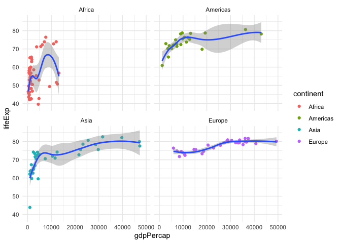

# assignment_5


``` r
library(tidyverse) 
```

    ── Attaching core tidyverse packages ──────────────────────── tidyverse 2.0.0 ──
    ✔ dplyr     1.1.4     ✔ readr     2.1.5
    ✔ forcats   1.0.0     ✔ stringr   1.5.2
    ✔ ggplot2   3.5.2     ✔ tibble    3.3.0
    ✔ lubridate 1.9.4     ✔ tidyr     1.3.1
    ✔ purrr     1.1.0     
    ── Conflicts ────────────────────────────────────────── tidyverse_conflicts() ──
    ✖ dplyr::filter() masks stats::filter()
    ✖ dplyr::lag()    masks stats::lag()
    ℹ Use the conflicted package (<http://conflicted.r-lib.org/>) to force all conflicts to become errors

``` r
library(knitr)

library(gapminder) #install.packages("gapminder")


library(readr)
```

# **Assignment 5: Data transformation and visualization - Part 2**

## Exercise 1. Trends in land value

``` r
housing <- read_csv("https://raw.githubusercontent.com/nt246/NTRES-6100-data-science/master/datasets/landdata_states.csv")
```

    Rows: 7803 Columns: 11
    ── Column specification ────────────────────────────────────────────────────────
    Delimiter: ","
    chr (2): State, region
    dbl (9): Date, Home.Value, Structure.Cost, Land.Value, Land.Share..Pct., Hom...

    ℹ Use `spec()` to retrieve the full column specification for this data.
    ℹ Specify the column types or set `show_col_types = FALSE` to quiet this message.

``` r
housing %>%
  head() %>% 
  kable()
```

| State | region | Date | Home.Value | Structure.Cost | Land.Value | Land.Share..Pct. | Home.Price.Index | Land.Price.Index | Year | Qrtr |
|:---|:---|---:|---:|---:|---:|---:|---:|---:|---:|---:|
| AK | West | 2010.25 | 224952 | 160599 | 64352 | 28.6 | 1.481 | 1.552 | 2010 | 1 |
| AK | West | 2010.50 | 225511 | 160252 | 65259 | 28.9 | 1.484 | 1.576 | 2010 | 2 |
| AK | West | 2009.75 | 225820 | 163791 | 62029 | 27.5 | 1.486 | 1.494 | 2009 | 3 |
| AK | West | 2010.00 | 224994 | 161787 | 63207 | 28.1 | 1.481 | 1.524 | 2009 | 4 |
| AK | West | 2008.00 | 234590 | 155400 | 79190 | 33.8 | 1.544 | 1.885 | 2007 | 4 |
| AK | West | 2008.25 | 233714 | 157458 | 76256 | 32.6 | 1.538 | 1.817 | 2008 | 1 |

``` r
head(housing)
```

    # A tibble: 6 × 11
      State region  Date Home.Value Structure.Cost Land.Value Land.Share..Pct.
      <chr> <chr>  <dbl>      <dbl>          <dbl>      <dbl>            <dbl>
    1 AK    West   2010.     224952         160599      64352             28.6
    2 AK    West   2010.     225511         160252      65259             28.9
    3 AK    West   2010.     225820         163791      62029             27.5
    4 AK    West   2010      224994         161787      63207             28.1
    5 AK    West   2008      234590         155400      79190             33.8
    6 AK    West   2008.     233714         157458      76256             32.6
    # ℹ 4 more variables: Home.Price.Index <dbl>, Land.Price.Index <dbl>,
    #   Year <dbl>, Qrtr <dbl>

### 1.1 Washington DC was not assigned to a region in this dataset. According to the United States Census Bureau, however, DC is part of the South region. Here:

``` r
housing_updated <- housing %>%
  mutate(region = ifelse(State == "DC", "South", region))
housing_subset <- housing_updated %>%
  select(State, Date, Land.Value, region)
dc_records <- housing_subset %>%
  filter(State == "DC")
n_dc_records <- nrow(dc_records)
cat("Number of DC records:", n_dc_records, "\n")
```

    Number of DC records: 153 

``` r
dc_records %>%
  head() %>%
  kable()
```

| State |    Date | Land.Value | region |
|:------|--------:|-----------:|:-------|
| DC    | 2003.00 |     290522 | South  |
| DC    | 2003.25 |     305673 | South  |
| DC    | 2003.50 |     323078 | South  |
| DC    | 2003.75 |     342010 | South  |
| DC    | 2004.00 |     361999 | South  |
| DC    | 2004.25 |     382792 | South  |

``` r
housing_updated <- housing %>%
  mutate(region = ifelse(State == "DC", "South", region))
housing_subset <- housing_updated %>%
  select(State, Date, Land.Value, region)
dc_records <- housing_subset %>%
  filter(State == "DC")
n_dc_records <- nrow(dc_records)
cat("Number of DC records:", n_dc_records, "\n")
```

    Number of DC records: 153 

``` r
dc_records %>%
  head() %>%
  kable()
```

| State |    Date | Land.Value | region |
|:------|--------:|-----------:|:-------|
| DC    | 2003.00 |     290522 | South  |
| DC    | 2003.25 |     305673 | South  |
| DC    | 2003.50 |     323078 | South  |
| DC    | 2003.75 |     342010 | South  |
| DC    | 2004.00 |     361999 | South  |
| DC    | 2004.25 |     382792 | South  |

``` r
dc_records <- housing %>%
  mutate(region = ifelse(State == "DC", "South", region)) %>%
  filter(State == "DC") %>%
  select(region, State, Land.Value, Date)
dc_records %>%
  head(6) %>%
  kable()
```

| region | State | Land.Value |    Date |
|:-------|:------|-----------:|--------:|
| South  | DC    |     290522 | 2003.00 |
| South  | DC    |     305673 | 2003.25 |
| South  | DC    |     323078 | 2003.50 |
| South  | DC    |     342010 | 2003.75 |
| South  | DC    |     361999 | 2004.00 |
| South  | DC    |     382792 | 2004.25 |

### 1.2 Generate a tibble/dataframe that summarizes the mean land value of each region at each time point and show its first 6 lines.

``` r
housing_updated <- housing %>%
  mutate(region = ifelse(State == "DC", "South", region))

mean_land_values <- housing_updated %>%
  group_by(region, Date) %>%
  summarize(mean_land_value = mean(Land.Value, na.rm = TRUE), .groups = 'drop')
mean_land_values %>%
  head(6) %>%
  kable()
```

| region  |    Date | mean_land_value |
|:--------|--------:|----------------:|
| Midwest | 1975.25 |        2452.167 |
| Midwest | 1975.50 |        2498.917 |
| Midwest | 1975.75 |        2608.167 |
| Midwest | 1976.00 |        2780.000 |
| Midwest | 1976.25 |        2967.333 |
| Midwest | 1976.50 |        3212.833 |

### 1.3 Using the tibble/dataframe from 1.2, plot the trend in mean land value of each region through time.

``` r
mean_land_values <- housing_updated %>%
  group_by(region, Date) %>%
  summarize(mean_land_value = mean(Land.Value, na.rm = TRUE), .groups = "drop")
  
housing_fixed <- housing %>%
  mutate(region = ifelse(State == "DC", "South", region))
  
mean_land_by_region <- housing_fixed %>%
  group_by(region, Date) %>%
  summarize(mean_land_value = mean(Land.Value, na.rm = TRUE), .groups = 'drop')
  
  
ggplot(mean_land_by_region, aes(x = Date, y = mean_land_value, color = region)) +
  geom_smooth(se = FALSE, size = 1.2) +
  labs(
    x = "Date",
    y = "Mean Land Value",
    color = "Region"
  ) +
  theme_minimal() +
  theme(
    text = element_text(size = 12),
    legend.position = "right")
```

    Warning: Using `size` aesthetic for lines was deprecated in ggplot2 3.4.0.
    ℹ Please use `linewidth` instead.

    `geom_smooth()` using method = 'loess' and formula = 'y ~ x'


``` r
ggplot(mean_land_values, aes(x = Date, y = mean_land_value, color = region)) +
  geom_smooth(se = FALSE, size = 1.2) +
  labs(title = "Trend in Mean Land Value by Region Over Time",
    x = "Date",
    y = "Mean Land Value",
    color = "Region") +
  theme_minimal() +
  theme(text = element_text(size = 12), plot.title = element_text(face = "bold", hjust = 0.5))
```

    `geom_smooth()` using method = 'loess' and formula = 'y ~ x'


## Exercise 2. Life expectancy and GDP per capita 1952-2007

``` r
#library(gapminder) #install.packages("gapminder")
gapminder %>%
  head() %>% 
  kable()
```

| country     | continent | year | lifeExp |      pop | gdpPercap |
|:------------|:----------|-----:|--------:|---------:|----------:|
| Afghanistan | Asia      | 1952 |  28.801 |  8425333 |  779.4453 |
| Afghanistan | Asia      | 1957 |  30.332 |  9240934 |  820.8530 |
| Afghanistan | Asia      | 1962 |  31.997 | 10267083 |  853.1007 |
| Afghanistan | Asia      | 1967 |  34.020 | 11537966 |  836.1971 |
| Afghanistan | Asia      | 1972 |  36.088 | 13079460 |  739.9811 |
| Afghanistan | Asia      | 1977 |  38.438 | 14880372 |  786.1134 |

``` r
gapminder %>% 
  head() %>% 
  kable()
```

| country     | continent | year | lifeExp |      pop | gdpPercap |
|:------------|:----------|-----:|--------:|---------:|----------:|
| Afghanistan | Asia      | 1952 |  28.801 |  8425333 |  779.4453 |
| Afghanistan | Asia      | 1957 |  30.332 |  9240934 |  820.8530 |
| Afghanistan | Asia      | 1962 |  31.997 | 10267083 |  853.1007 |
| Afghanistan | Asia      | 1967 |  34.020 | 11537966 |  836.1971 |
| Afghanistan | Asia      | 1972 |  36.088 | 13079460 |  739.9811 |
| Afghanistan | Asia      | 1977 |  38.438 | 14880372 |  786.1134 |

### 2.1 Use a scatterplot to explore the relationship between per capita GDP (gdpPercap) and life expectancy (lifeExp) in the year 2007.

``` r
gapminder %>%
  filter(year == 2007) %>%
  ggplot(aes(x = gdpPercap, y = lifeExp)) +
  geom_point() +
  ggtitle("GDP per Capita vs Life Expectancy (2007)") +
  xlab("GDP per Capita") +
  ylab("Life Expectancy (years)") +
  theme_minimal()
```


### 2.2 Add a smoothing line to the previous plot.

``` r
gapminder %>%
  filter(year == 2007) %>%
  ggplot(aes(x = gdpPercap, y = lifeExp)) +
  geom_point() +
  geom_smooth() +
  ggtitle("GDP per Capita vs Life Expectancy (2007)") +
  xlab("GDP per Capita") +
  ylab("Life Expectancy (years)") +
  theme_minimal()
```

    `geom_smooth()` using method = 'loess' and formula = 'y ~ x'


### 2.3 Exclude Oceania from the previous plot, show each continent in a different color, and fit a separate smoothing line to each continent to identify differences in this relationship between continents. Turn off the confidence intervals.

``` r
gapminder %>%
  filter(year == 2007, continent != "Oceania") %>%
  ggplot(aes(x = gdpPercap, y = lifeExp, color = continent)) +
  geom_point() +
  geom_smooth(se = FALSE) +
  ggtitle("GDP per Capita vs Life Expectancy (2007, by Continent)") +
  xlab("GDP per Capita") +
  ylab("Life Expectancy (years)") +
  theme_minimal()
```

    `geom_smooth()` using method = 'loess' and formula = 'y ~ x'


### 2.4 Use faceting to solve the same problem. Include the confidence intervals in this plot.

``` r
gapminder %>%
  filter(year == 2007, continent != "Oceania") %>%
  ggplot(aes(x = gdpPercap, y = lifeExp)) +
  geom_point(aes(color = continent)) +
  geom_smooth() +
  facet_wrap(~ continent) +
  theme_minimal()
```

    `geom_smooth()` using method = 'loess' and formula = 'y ~ x'



``` r
gapminder %>%
  filter(year == 2007, continent != "Oceania") %>% ggplot(aes(x = gdpPercap, y = lifeExp, color = continent)) +
  geom_point() +
  geom_smooth(se = TRUE) +  
  facet_wrap(~ continent)
```

    `geom_smooth()` using method = 'loess' and formula = 'y ~ x'


### 2.5 Explore the trend in life expectancy through time in each continent. Color by continent.

``` r
ggplot(gapminder, aes(x = year, y = lifeExp, color = continent)) +
  stat_summary(fun = "mean", geom = "line", size = 1.2) +
  labs(title = "Life Expectancy Over Time by Continent",
       x = "Year",
       y = "Life Expectancy (years)") +
  theme_minimal()
```


``` r
ggplot(gapminder, aes(x = year, y = lifeExp, group = country,color = continent)) +
  #geom_line(aes(color = continent))+
  stat_summary(fun = "mean", geom = "line", size = 1) +   
  facet_wrap(~continent) +
  theme_minimal() +
  theme(legend.position = "none")
```


### 2.6 From the previous plot, we see some abnormal trends in Asia and Africa, where the the life expectancy in some countries sharply dropped at certain time periods. Here, we look into what happened in Asia in more detail. First, create a new dataset by filtering only the Asian countries. Show the first 6 lines of this filtered dataset.

``` r
asia_data <- gapminder %>%
  filter(continent == "Asia")

view(asia_data)


head(asia_data)
```

    # A tibble: 6 × 6
      country     continent  year lifeExp      pop gdpPercap
      <fct>       <fct>     <int>   <dbl>    <int>     <dbl>
    1 Afghanistan Asia       1952    28.8  8425333      779.
    2 Afghanistan Asia       1957    30.3  9240934      821.
    3 Afghanistan Asia       1962    32.0 10267083      853.
    4 Afghanistan Asia       1967    34.0 11537966      836.
    5 Afghanistan Asia       1972    36.1 13079460      740.
    6 Afghanistan Asia       1977    38.4 14880372      786.

### 2.7 Using the filtered dataset, identify the countries that had abnormal trends in life expectancy by plotting, and discuss historical events possibly explaining these trends. (Hint: facet by country)

Looking at the data, some countries in Asia experienced sharp drops in
life expectancy during certain periods, while others saw steady
increases. For example, Cambodia’s life expectancy fell dramatically in
the late 1970s before recovering in the 1980s, and North Korea saw
declines in the 1990s likely due to famine. In contrast, countries like
Afghanistan, India, and China show a steady upward trend in life
expectancy over the decades. These differences reflect the impacts of
war, famine, political instability, and improvements in healthcare and
living conditions.
