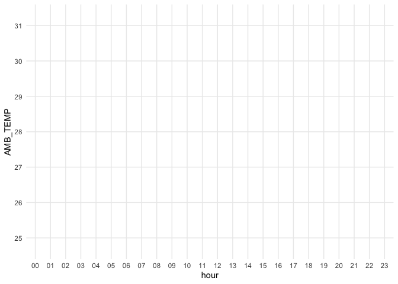
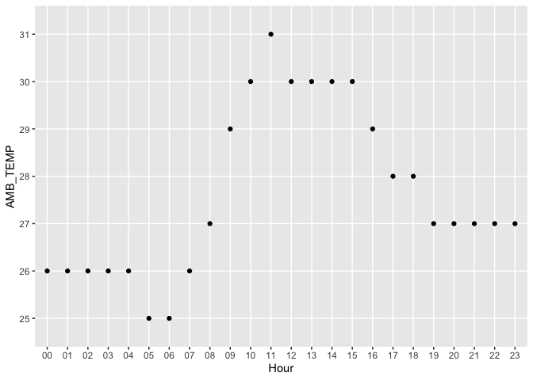
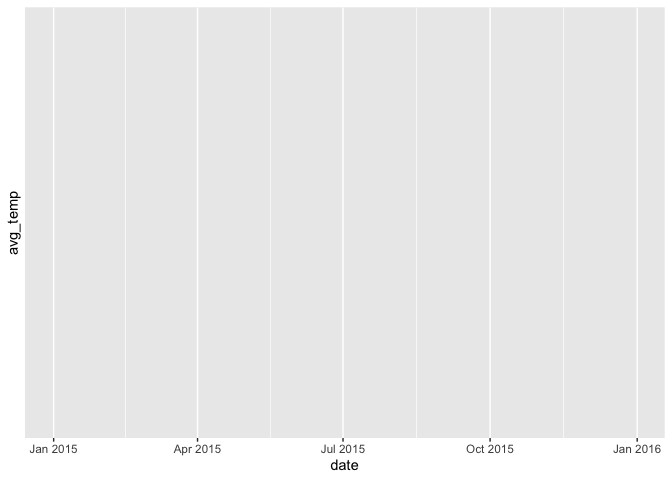

# assignment_6


``` r
library(tidyverse) #install.packages(tidyverse)

library(knitr) #install.packages(knitr)
```

# Exercise 1.1 Create the following tibble manually, first using tribble() and then using tibble(). Print both results.

``` r
tribble_example <- tribble(
  ~a, ~b, ~c,
   1,  2.1, "apple",
   2,  3.2, "orange")


tibble_example <- tibble(
  a = c(1, 2),
  b = c(2.1, 3.2),
  c = c("apple", "orange"))
```

## 1.2 Import https://raw.githubusercontent.com/nt246/NTRES-6100-data-science/master/datasets/dataset2.txt into R. Change the column names into “Name”, “Weight”, “Price”.

``` r
url <- "https://raw.githubusercontent.com/nt246/NTRES-6100-data-science/master/datasets/dataset2.txt"


data2 <- read.csv(url, header = FALSE, stringsAsFactors = FALSE)

colnames(data2) <- c("Name", "Weight", "Price")

data2
```

        Name Weight Price
    1  apple      1   2.9
    2 orange      2   4.9
    3 durian     10  19.9

## 1.3 Import https://raw.githubusercontent.com/nt246/NTRES-6100-data-science/master/datasets/dataset3.txt into R. Watch out for the first few lines, missing values, separators, quotation marks, and deliminaters.

``` r
url <- "https://raw.githubusercontent.com/nt246/NTRES-6100-data-science/master/datasets/dataset3.txt"

data3 <- read.table(url, 
                    header = TRUE, 
                    sep = ",", 
                    quote = "\"",
                    na.strings = c("", "NA"),
                    strip.white = TRUE,
                    comment.char = "",
                    stringsAsFactors = FALSE)


library(tibble)
data3 <- as_tibble(data3)


data3
```

    # A tibble: 5 × 1
      Table.of.fruits         
      <chr>                   
    1 09/25/18                
    2 /Name/;/Weight/;/Price/ 
    3 /apple/;1;2.9           
    4 /orange/;2;Not Available
    5 /durian/;?;19.9         

``` r
view(data3)

library(tidyverse)
url <- "https://raw.githubusercontent.com/nt246/NTRES-6100-data-science/master/datasets/dataset3.txt"
data3 <- read.delim(url,
                    sep = ";",
                    skip = 2,
                    na.strings = c("?", "Not Available"),
                    strip.white = TRUE,
                    stringsAsFactors = FALSE)

data3 <- data3 %>%
  mutate(across(everything(), ~ gsub("/", "", .)))

data3 <- as_tibble(data3)

data3
```

    # A tibble: 3 × 3
      X.Name. X.Weight. X.Price.
      <chr>   <chr>     <chr>   
    1 apple   1         2.9     
    2 orange  2         <NA>    
    3 durian  <NA>      19.9    

``` r
view(data3)
```

# Exercise 2. Weather station

## 2.1 Variable descriptions

``` r
url <- "https://raw.githubusercontent.com/nt246/NTRES-6100-data-science/master/datasets/2015y_Weather_Station_notes.txt"

lines <- readLines(url)
 
read_delim("https://raw.githubusercontent.com/nt246/NTRES-6100-data-science/master/datasets/2015y_Weather_Station_notes.txt", delim = "-")
```

    # A tibble: 15 × 3
       Item       Unit    Description                                              
       <chr>      <chr>   <chr>                                                    
     1 AMB_TEMP   Celsius Ambient air temperature                                  
     2 CO         ppm     Carbon monoxide                                          
     3 NO         ppb     Nitric oxide                                             
     4 NO2        ppb     Nitrogen dioxide                                         
     5 NOx        ppb     Nitrogen oxides                                          
     6 O3         ppb     Ozone                                                    
     7 PM10       μg/m3   Particulate matter with a diameter between 2.5 and 10 μm 
     8 PM2.5      μg/m3   Particulate matter with a diameter of 2.5 μm or less     
     9 RAINFALL   mm      Rainfall                                                 
    10 RH         %       Relative humidity                                        
    11 SO2        ppb     Sulfur dioxide                                           
    12 WD_HR      degress Wind direction (The average of hour)                     
    13 WIND_DIREC degress Wind direction (The average of last ten minutes per hour)
    14 WIND_SPEED m/sec   Wind speed (The average of last ten minutes per hour)    
    15 WS_HR      m/sec   Wind speed (The average of hour)                         

``` r
weather <- read_delim(
  "https://raw.githubusercontent.com/nt246/NTRES-6100-data-science/master/datasets/2015y_Weather_Station_notes.txt",
  delim = "-",
  col_names = c("Variable", "Description", "Unit"),
  trim_ws = TRUE
)


kable(weather)
```

| Variable | Description | Unit |
|:---|:---|:---|
| Item | Unit | Description |
| AMB_TEMP | Celsius | Ambient air temperature |
| CO | ppm | Carbon monoxide |
| NO | ppb | Nitric oxide |
| NO2 | ppb | Nitrogen dioxide |
| NOx | ppb | Nitrogen oxides |
| O3 | ppb | Ozone |
| PM10 | μg/m3 | Particulate matter with a diameter between 2.5 and 10 μm |
| PM2.5 | μg/m3 | Particulate matter with a diameter of 2.5 μm or less |
| RAINFALL | mm | Rainfall |
| RH | % | Relative humidity |
| SO2 | ppb | Sulfur dioxide |
| WD_HR | degress | Wind direction (The average of hour) |
| WIND_DIREC | degress | Wind direction (The average of last ten minutes per hour) |
| WIND_SPEED | m/sec | Wind speed (The average of last ten minutes per hour) |
| WS_HR | m/sec | Wind speed (The average of hour) |

## 2.2 Data tidying

``` r
url <- "https://raw.githubusercontent.com/nt246/NTRES-6100-data-science/master/datasets/2015y_Weather_Station.csv"


weather <- read_csv(url)
weather <- read_csv("https://raw.githubusercontent.com/nt246/NTRES-6100-data-science/master/datasets/2015y_Weather_Station.csv")


 
head(weather,6) %>% select(1:10)
```

    # A tibble: 6 × 10
      date       station item      `00`  `01`  `02`  `03` `04`   `05`  `06`
      <date>     <chr>   <chr>    <dbl> <dbl> <dbl> <dbl> <chr> <dbl> <dbl>
    1 2015-01-01 Cailiao AMB_TEMP 16     16   15    15    15    14    14   
    2 2015-01-01 Cailiao CO        0.74   0.7  0.66  0.61 0.51   0.51  0.51
    3 2015-01-01 Cailiao NO        1      0.8  1.1   1.7  2      1.7   1.9 
    4 2015-01-01 Cailiao NO2      15     13   13    12    11    13    13   
    5 2015-01-01 Cailiao NOx      16     14   14    13    13    15    15   
    6 2015-01-01 Cailiao O3       35     36   35    34    34    32    30   

``` r
weather_untidy <- read_csv("https://raw.githubusercontent.com/nt246/NTRES-6100-data-science/master/datasets/2015y_Weather_Station.csv")


weather_long <- weather_untidy %>%
  mutate(across(`00`:`23`, as.character)) %>% 
  pivot_longer(
    cols = `00`:`23`,
    names_to = "hour",
    values_to = "value"
  )

weather_tidy <- weather_long %>%
  pivot_wider(
    names_from = item,
    values_from = value
  )

 
head(weather_tidy,6) %>% select(1:10)
```

    # A tibble: 6 × 10
      date       station hour  AMB_TEMP CO    NO    NO2   NOx   O3    PM10 
      <date>     <chr>   <chr> <chr>    <chr> <chr> <chr> <chr> <chr> <chr>
    1 2015-01-01 Cailiao 00    16       0.74  1     15    16    35    171  
    2 2015-01-01 Cailiao 01    16       0.7   0.8   13    14    36    174  
    3 2015-01-01 Cailiao 02    15       0.66  1.1   13    14    35    160  
    4 2015-01-01 Cailiao 03    15       0.61  1.7   12    13    34    142  
    5 2015-01-01 Cailiao 04    15       0.51  2     11    13    34    123  
    6 2015-01-01 Cailiao 05    14       0.51  1.7   13    15    32    110  

## 2.3 Using this cleaned dataset, plot the daily variation in ambient temperature on September 25, 2015, as shown below.

``` r
weather_sep252015<- weather_tidy %>%
  filter(date == as.Date("2015-09-25"))

ggplot(weather_sep252015, aes(x = hour, y = AMB_TEMP)) +
  geom_line(color = "Station") +
  labs(x = "hour", y = "AMB_TEMP") +
  theme_minimal() 
```



``` r
ggplot(weather_sep252015, aes(x = hour, y = AMB_TEMP)) +
  geom_line() + geom_point() +
  labs(x = "Hour",
    y = "AMB_TEMP"
  )
```



## 2.4 Plot the daily average ambient temperature throughout the year with a continuous line, as shown below.

``` r
daily_ave <- weather_tidy %>%
  group_by(date) %>%
  summarise(avg_temp = mean(AMB_TEMP, na.rm = TRUE))


ggplot(daily_ave, aes(x = date, y= avg_temp)) + geom_line()
```



## 2.5 Plot the total rainfall per month in a bar chart, as shown below.
