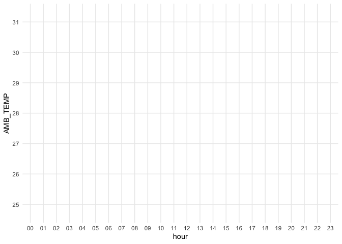
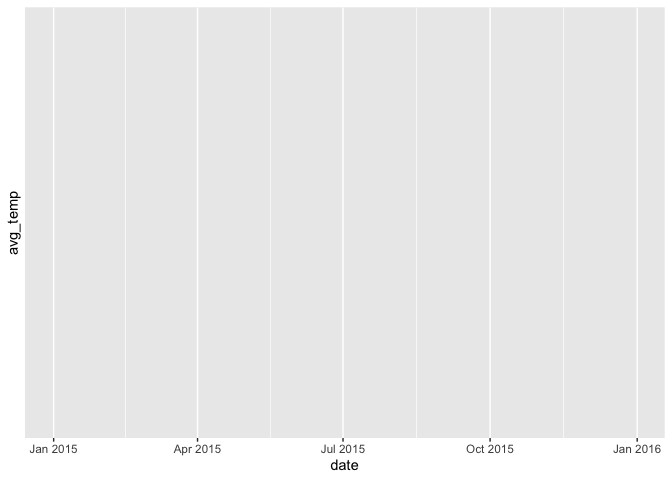

# assignment_6


``` r
library(tidyverse) #install.packages(tidyverse)

library(knitr) #install.packages(knitr)
```

# Exercise 1.1 Create the following tibble manually, first using tribble() and then using tibble(). Print both results.

``` r
tribble_example <- tribble(
  ~a, ~b, ~c,
   1,  2.1, "apple",
   2,  3.2, "orange")

tribble_example
```

    # A tibble: 2 × 3
          a     b c     
      <dbl> <dbl> <chr> 
    1     1   2.1 apple 
    2     2   3.2 orange

``` r
tibble_example <- tibble(
  a = c(1, 2),
  b = c(2.1, 3.2),
  c = c("apple", "orange"))

tibble_example
```

    # A tibble: 2 × 3
          a     b c     
      <dbl> <dbl> <chr> 
    1     1   2.1 apple 
    2     2   3.2 orange

## 1.2 Import https://raw.githubusercontent.com/nt246/NTRES-6100-data-science/master/datasets/dataset2.txt into R. Change the column names into “Name”, “Weight”, “Price”.

``` r
url <- "https://raw.githubusercontent.com/nt246/NTRES-6100-data-science/master/datasets/dataset2.txt"


data2 <- read.csv(url, header = FALSE, stringsAsFactors = FALSE)

colnames(data2) <- c("Name", "Weight", "Price")

data2
```

        Name Weight Price
    1  apple      1   2.9
    2 orange      2   4.9
    3 durian     10  19.9

## 1.3 Import https://raw.githubusercontent.com/nt246/NTRES-6100-data-science/master/datasets/dataset3.txt into R. Watch out for the first few lines, missing values, separators, quotation marks, and deliminaters.

``` r
url <- "https://raw.githubusercontent.com/nt246/NTRES-6100-data-science/master/datasets/dataset3.txt"

data3 <- read.table(url, 
                    header = TRUE, 
                    sep = ",", 
                    quote = "\"",
                    na.strings = c("", "NA"),
                    strip.white = TRUE,
                    comment.char = "",
                    stringsAsFactors = FALSE)


library(tibble)
data3 <- as_tibble(data3)


data3
```

    # A tibble: 5 × 1
      Table.of.fruits         
      <chr>                   
    1 09/25/18                
    2 /Name/;/Weight/;/Price/ 
    3 /apple/;1;2.9           
    4 /orange/;2;Not Available
    5 /durian/;?;19.9         

``` r
view(data3)

library(tidyverse)
url <- "https://raw.githubusercontent.com/nt246/NTRES-6100-data-science/master/datasets/dataset3.txt"
data3 <- read.delim(url,
                    sep = ";",
                    skip = 2,
                    na.strings = c("?", "Not Available"),
                    strip.white = TRUE,
                    stringsAsFactors = FALSE)

data3 <- data3 %>%
  mutate(across(everything(), ~ gsub("/", "", .)))

data3 <- as_tibble(data3)

data3
```

    # A tibble: 3 × 3
      X.Name. X.Weight. X.Price.
      <chr>   <chr>     <chr>   
    1 apple   1         2.9     
    2 orange  2         <NA>    
    3 durian  <NA>      19.9    

``` r
view(data3)
```

## 1.4 Import https://raw.githubusercontent.com/nt246/NTRES-6100-data-science/master/datasets/dataset4.txt into R. Watch out for comments, units, and decimal marks (which are , in this case)

``` r
data <- read_lines("https://raw.githubusercontent.com/nt246/NTRES-6100-data-science/master/datasets/dataset4.txt")

data <- data[!str_detect(data, "This is a comment")]

data <- read_table2(
  "https://raw.githubusercontent.com/nt246/NTRES-6100-data-science/master/datasets/dataset4.txt",
  comment = "This is a comment",
  col_names = c("Name", "Weight", "Price")
)

data_clean <- data %>%
  mutate(
    Weight = as.numeric(str_replace(Weight, "kg", "")),
    Price = as.numeric(str_replace(str_replace(Price, "€", ""), ",", "."))
  )

data_clean
```

    # A tibble: 4 × 3
      Name   Weight Price
      <chr>   <dbl> <dbl>
    1 Name       NA  NA  
    2 apple       1   2.9
    3 orange      2   4.9
    4 durian     10  19.9

## 1.5 Import https://raw.githubusercontent.com/nt246/NTRES-6100-data-science/master/datasets/dataset5.txt into R. Parse the columns properly. As a reminder, you can read about parsing date and time data here. Write this imported and parsed data frame into a new csv file named dataset5_new.csv in your problem_sets folder.

``` r
library(tidyverse)
library(lubridate)

library(tidyverse)
library(lubridate)

lines <- read_lines("https://raw.githubusercontent.com/nt246/NTRES-6100-data-science/master/datasets/dataset5.txt")

data5 <- lines[-1] %>%  # remove header line
  str_remove_all('"') %>%   # remove all quotes
  str_split_fixed("\t", 3) %>%  # split into 3 columns
  as_tibble()   


colnames(data5) <- c("Name", "Expiration_Date", "Time")


data5
```

    # A tibble: 3 × 3
      Name                            Expiration_Date Time 
      <chr>                           <chr>           <chr>
    1 apple September 26, 2018 1:00am ""              ""   
    2 orange October 2, 2018 1:00pm   ""              ""   
    3 durian October 21, 2018 11:00am ""              ""   

# Exercise 2. Weather station

## 2.1 Variable descriptions

``` r
url <- "https://raw.githubusercontent.com/nt246/NTRES-6100-data-science/master/datasets/2015y_Weather_Station_notes.txt"

lines <- readLines(url)
 
read_delim("https://raw.githubusercontent.com/nt246/NTRES-6100-data-science/master/datasets/2015y_Weather_Station_notes.txt", delim = "-")
```

    # A tibble: 15 × 3
       Item       Unit    Description                                              
       <chr>      <chr>   <chr>                                                    
     1 AMB_TEMP   Celsius Ambient air temperature                                  
     2 CO         ppm     Carbon monoxide                                          
     3 NO         ppb     Nitric oxide                                             
     4 NO2        ppb     Nitrogen dioxide                                         
     5 NOx        ppb     Nitrogen oxides                                          
     6 O3         ppb     Ozone                                                    
     7 PM10       μg/m3   Particulate matter with a diameter between 2.5 and 10 μm 
     8 PM2.5      μg/m3   Particulate matter with a diameter of 2.5 μm or less     
     9 RAINFALL   mm      Rainfall                                                 
    10 RH         %       Relative humidity                                        
    11 SO2        ppb     Sulfur dioxide                                           
    12 WD_HR      degress Wind direction (The average of hour)                     
    13 WIND_DIREC degress Wind direction (The average of last ten minutes per hour)
    14 WIND_SPEED m/sec   Wind speed (The average of last ten minutes per hour)    
    15 WS_HR      m/sec   Wind speed (The average of hour)                         

``` r
weather <- read_delim(
  "https://raw.githubusercontent.com/nt246/NTRES-6100-data-science/master/datasets/2015y_Weather_Station_notes.txt",
  delim = "-",
  col_names = c("Variable", "Description", "Unit"),
  trim_ws = TRUE
)
```

## 2.2 Data tidying

``` r
library(readr) #install.packages("readr")
library(tidyverse)
library(lubridate)

weather_Taiwan <- read_csv(
  "https://raw.githubusercontent.com/nt246/NTRES-6100-data-science/master/datasets/2015y_Weather_Station.csv",
  col_names = TRUE,
  col_types = cols(.default = "c")
)

weather_Taiwan
```

    # A tibble: 5,460 × 27
       date      station item  `00`  `01`  `02`  `03`  `04`  `05`  `06`  `07`  `08` 
       <chr>     <chr>   <chr> <chr> <chr> <chr> <chr> <chr> <chr> <chr> <chr> <chr>
     1 2015/01/… Cailiao AMB_… 16    16    15    15    15    14    14    14    14   
     2 2015/01/… Cailiao CO    0.74  0.7   0.66  0.61  0.51  0.51  0.51  0.6   0.62 
     3 2015/01/… Cailiao NO    1     0.8   1.1   1.7   2     1.7   1.9   2.4   3.4  
     4 2015/01/… Cailiao NO2   15    13    13    12    11    13    13    16    16   
     5 2015/01/… Cailiao NOx   16    14    14    13    13    15    15    18    19   
     6 2015/01/… Cailiao O3    35    36    35    34    34    32    30    26    26   
     7 2015/01/… Cailiao PM10  171   174   160   142   123   110   104   104   109  
     8 2015/01/… Cailiao PM2.5 76    78    69    60    52    44    40    41    44   
     9 2015/01/… Cailiao RAIN… NR    NR    NR    NR    NR    NR    NR    NR    NR   
    10 2015/01/… Cailiao RH    57    57    58    59    59    57    57    56    53   
    # ℹ 5,450 more rows
    # ℹ 15 more variables: `09` <chr>, `10` <chr>, `11` <chr>, `12` <chr>,
    #   `13` <chr>, `14` <chr>, `15` <chr>, `16` <chr>, `17` <chr>, `18` <chr>,
    #   `19` <chr>, `20` <chr>, `21` <chr>, `22` <chr>, `23` <chr>

``` r
head(weather_Taiwan, 10)
```

    # A tibble: 10 × 27
       date      station item  `00`  `01`  `02`  `03`  `04`  `05`  `06`  `07`  `08` 
       <chr>     <chr>   <chr> <chr> <chr> <chr> <chr> <chr> <chr> <chr> <chr> <chr>
     1 2015/01/… Cailiao AMB_… 16    16    15    15    15    14    14    14    14   
     2 2015/01/… Cailiao CO    0.74  0.7   0.66  0.61  0.51  0.51  0.51  0.6   0.62 
     3 2015/01/… Cailiao NO    1     0.8   1.1   1.7   2     1.7   1.9   2.4   3.4  
     4 2015/01/… Cailiao NO2   15    13    13    12    11    13    13    16    16   
     5 2015/01/… Cailiao NOx   16    14    14    13    13    15    15    18    19   
     6 2015/01/… Cailiao O3    35    36    35    34    34    32    30    26    26   
     7 2015/01/… Cailiao PM10  171   174   160   142   123   110   104   104   109  
     8 2015/01/… Cailiao PM2.5 76    78    69    60    52    44    40    41    44   
     9 2015/01/… Cailiao RAIN… NR    NR    NR    NR    NR    NR    NR    NR    NR   
    10 2015/01/… Cailiao RH    57    57    58    59    59    57    57    56    53   
    # ℹ 15 more variables: `09` <chr>, `10` <chr>, `11` <chr>, `12` <chr>,
    #   `13` <chr>, `14` <chr>, `15` <chr>, `16` <chr>, `17` <chr>, `18` <chr>,
    #   `19` <chr>, `20` <chr>, `21` <chr>, `22` <chr>, `23` <chr>

``` r
weather_Taiwan_cleaned <- weather_Taiwan |>
  pivot_longer(cols= '00':'23', names_to= "hour", values_to= "value") |>
  pivot_wider(names_from = item, values_from = value) |>
  mutate(RAINFALL = ifelse(RAINFALL == "NR", "0", RAINFALL)) |>
  mutate(date = as.Date(date),
         across(AMB_TEMP:PM10, as.numeric),
         hour = hms :: as_hms(paste0(hour, ":00:00")))

weather_Taiwan_cleaned |>
  select(1:10) |>
  head()
```

    # A tibble: 6 × 10
      date       station hour   AMB_TEMP    CO    NO   NO2   NOx    O3  PM10
      <date>     <chr>   <time>    <dbl> <dbl> <dbl> <dbl> <dbl> <dbl> <dbl>
    1 2015-01-01 Cailiao 00:00        16  0.74   1      15    16    35   171
    2 2015-01-01 Cailiao 01:00        16  0.7    0.8    13    14    36   174
    3 2015-01-01 Cailiao 02:00        15  0.66   1.1    13    14    35   160
    4 2015-01-01 Cailiao 03:00        15  0.61   1.7    12    13    34   142
    5 2015-01-01 Cailiao 04:00        15  0.51   2      11    13    34   123
    6 2015-01-01 Cailiao 05:00        14  0.51   1.7    13    15    32   110

## 2.3 Using this cleaned dataset, plot the daily variation in ambient temperature on September 25, 2015, as shown below.

``` r
weather_Taiwan_cleaned |>
  filter(date == "2015-09-25") |>
  ggplot(aes(x = hour, y=AMB_TEMP)) + geom_line()
```



## 2.4 Plot the daily average ambient temperature throughout the year with a continuous line, as shown below.

``` r
weather_Taiwan_cleaned |> 
  group_by(date) |>
  summarize(daily_average_ambient_temp= mean(AMB_TEMP)) |>
  ggplot(aes(x=date, y=daily_average_ambient_temp)) + geom_line()
```



## 2.5 Plot the total rainfall per month in a bar chart, as shown below.

``` r
weather_Taiwan_cleaned |> 
  mutate(year = format(date, "%Y"), month = format(date, "%m"), day = format(date, "%d"), RAINFALL = as.numeric(RAINFALL))|>
  group_by(month) |>
  summarise(MonthlyRainfall = sum(RAINFALL, na.rm = TRUE)) |>
  ggplot(aes(x=month, y=MonthlyRainfall)) + geom_col()
```


\##2.6 Plot the per hour variation in PM2.5 in the first week of
September with a continuous line, as shown below.

``` r
weather_Taiwan_cleaned |> 
  filter(format(date, "%m") == "09", format(date, "%d") <= "07") |> 
  mutate(time_str = paste(date, hour), PM2.5 = as.numeric(PM2.5)) |> 
  mutate(time = parse_datetime(time_str, format = "%Y-%m-%d %H:%M:%S")) |> 
  ggplot(aes(x = time, y = PM2.5)) +
  geom_line()
```


